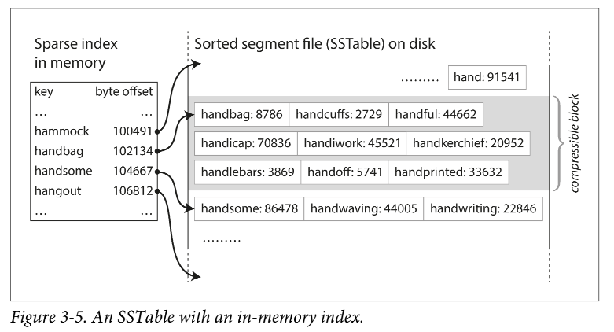
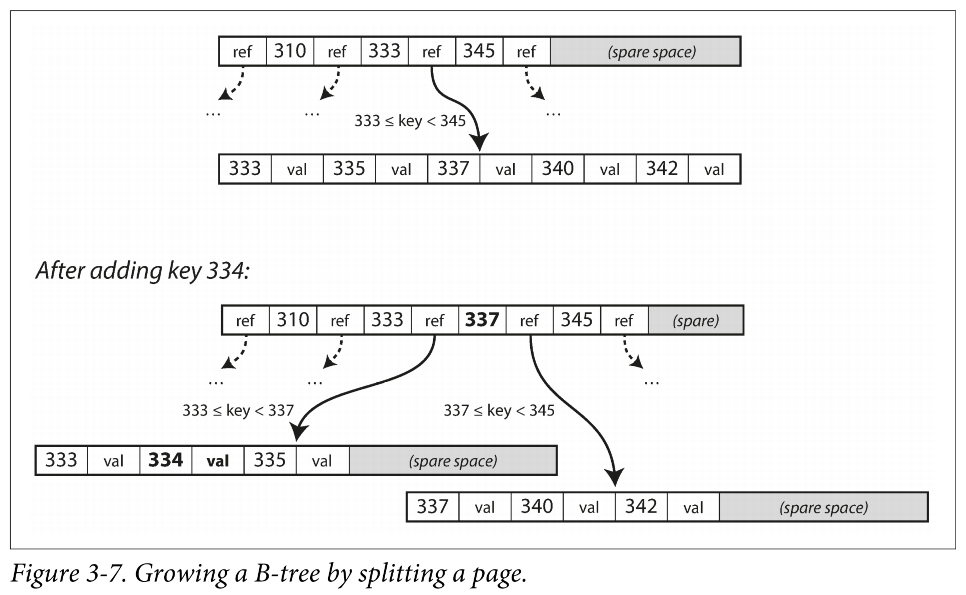
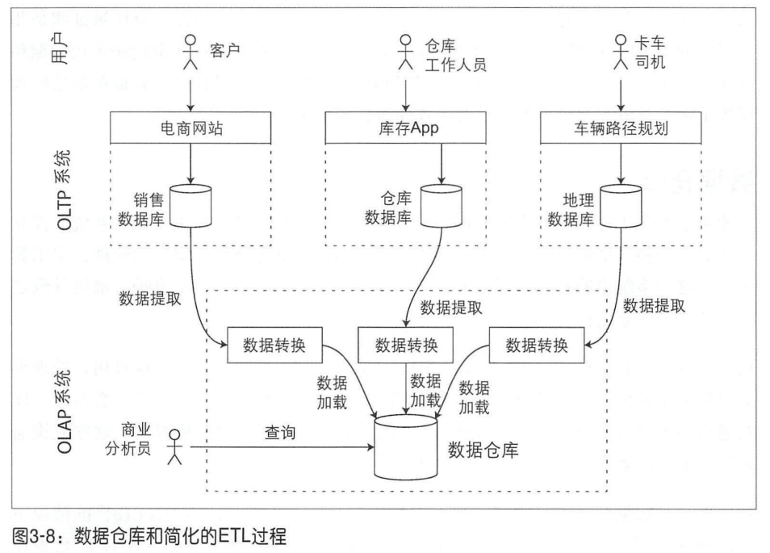

## 索引

### 简介

为了高效地查找数据库中特定键的值，需要新的数据结构：索引。所有索引背后的基本想法都是保留一些额外的元数据（metadata），这些元数据作为路标，帮助定位想要的数据。

索引是基于原始数据派生而来的额外数据结构，很多数据库都允许单独添加和删除索引而不影响数据库内容，它只会影响查询性能。维护额外的结构会引入新的开销，特别是在写操作的时候。对于写入，它很难超过简单追加文件方式的性能，但由于每次写数据时都需要更新索引，因此任何类型的索引通常都会降低写的速度。

这里涉及到一个重要的权衡设计：适当的索引可以加速读取查询，但每个索引都会减慢写速度。

### key-value 索引 1 - 哈希索引

以 `Bitcask` 存储引擎来举例，可以用哈希表把每个键一一映射到数据文件中额字节偏移量，之后保存这个哈希表就成为了数据库的索引（如下图所示）。

这种存储引擎非常适合每个键值频繁更新的场景，对于这种工作负载，有很多写操作，但没有太多不同的 key。

#### 局限性

- 哈希表必须全部放入内存，如果有大量的 key，则有可能会有 OOM Error。
- 区间查询效率不高，这是由哈希表的无序性决定的，例如，我们想查询 `kitty000` 和 `kitty999` 区间内的所有键，只能采用逐个查找的方式查询每一个键。

### key-value 索引 2 - SSTables

SSTables，全称叫 Sorted String Tables，翻译成中文叫排序字符串表。它的本质也是一个 key-value 结构的表，只不过要求所有的键值对按照 key 来排序。它要求每个键在每个合并的段文件中只能出现一次（压缩过程已经确保了），与普通的哈希索引日志段相比，SSTables 具有以下优点：

1. 合并更加高效，可以采取类似于 merge sort 的算法进行合并（如下图所示）。即使相同的键出现在多个输入段也没有关系，因为每个段都包含在某短时间内写入数据库的所有值，因此我们可以直接保留最新段的值，丢弃旧段中的值即可。
   
2. 在文档中查找特定的键时，不再需要在内存中保存所有键的索引。由于所有的键都是排好序的，我们可以通过范围查询来快速定位要查找的键。尽管我们仍需要使用一个内存索引来记录某些键的偏移（如下图所示），但该索引可以是稀疏的。
   
3. 由于读请求往往需要首先扫描我们上面提到的稀疏索引，因此对于该稀疏索引指向的记录们，可以考虑将它们保存到一个块中并在写磁盘前进行压缩，节省了磁盘空间 + 减少了 I/O 带宽的占用

#### SSTable 的构建和维护

存储引擎的基本工作流程如下

- 当写入时，将其添加到内存中的平衡树结构中（如红黑树），这个树有时被称为内存表
- 当内存表大于某个阈值时，将其作为 SSTable 文件写入磁盘
- 为了处理读请求，首先尝试在内存表中查找键，然后按照从新到旧的顺序依次查找磁盘段文件，直到找到目标
- 后台进程会周期性地执行段合并与压缩过程以合并多个段文件，并丢弃那些已被覆盖或删除的值

#### 从 SSTable 到 LSM-Tree

上面描述的索引结构最初由 Patrick O'Neil 等人以 `Log-Structured Merge-Tree` 命名，取其首字母就是 `LSM-Tree`，它建立在更早期的日志结构文件系统之上，因此基于合并和压缩排序文件原理的存储引擎通常都被称为 LSM 存储引擎。

#### 性能优化

当查找数据库中某个不存在的键时，LSM-Tree 算法可能会很慢，因为它要从内存表扫描到最旧的段文件。为了优化这种访问，存储引擎通常使用额外的布隆过滤器。

不同的策略也会影响甚至决定 SSTables 压缩和合并的具体顺序和时机，最常见的方式是大小分级和分层压缩。大小分级压缩中，较新和较小的 SSTables 被连续合并到较旧和较大的 SSTables 中；分层压缩中，键的范围分裂成多个更小的 SSTables，旧数据被移动到单独的层级。

即使有许多细微差异，LSM-Tree 的基本思想都是一致且有效的，即保存在后台合并一些列的 SSTable。由于数据按顺序排列存储，因此可以有效地执行区间查询，并且由于磁盘是顺序写入的，所以 LSM-Tree 可以支持非常高的写入吞吐量。

### key-value 索引 3 - B-Tree

B-Tree 保留按键值排序的 key-value 对，这样可以实现高效的 key-value 查找和区间查询。B-Tree 将数据库分解成固定大小的块或页，传统上大小为 4KB，页是内部读写的最小单元。每个页面都可以使用地址或位置进行标识，这样可以让一个页面引用另一个页面，类似指针，不过是指向磁盘地址而不是内存。某一页会被指定为 B-Tree 的根，每当查找索引中的一个键时，总是从这里开始。如下图所示，我们要寻找 `key = 251`，则从根节点开始不断向下确定范围，当最终来到叶子节点的时候从头遍历即可。

B-Tree 中一个页所包含的子页引用数量称为分支因子，上图中的分支因子为 6，因为每个节点有 6 个子节点。在实际中，分支因素取决于存储页面引用范围边界所需的空间总量，通常为几百个。

B-Tree 的更新操作比较容易理解，我们先搜索包含该键的叶子节点（叶子页），在将其值修改之后重新写回磁盘即可。

添加新键的时候有额外的清况要考虑：首先需要找到其范围包含新键的页，并将新的键添加到该页。如果此时该页的分支数量已经超出了分支因子（即没有空间来容纳新键），则我们要将该页分裂成两个半满的页，并且父页也需要更新以包含分裂之后的新的键的范围。父页在分裂的时候是一个递归的过程，直到我们遇到一个满足分支因子的节点。例如下图中我们想要添加一个新的 `key = 334`，从根节点向下进行范围搜索，它落在 `[333, 345]` 区间，就这样依次查询直到我们找到了叶子页，由于页中的 key 是有序的，因此新键要插入在 335 和 337 之间。由于插入新键后分支数量变为了 7，大于我们规定的分支因子，因此要进行分裂。分裂成两个半满的页后，`337` 作为分裂点要被存在它的父节点中。

通过这种插入算法，我们可以确保 B-Tree 是平衡的，深度为 `O(logn)`。大多数数据库可以适合 3-4 层的 B-Tree，不需要遍历非常深的页面层次即可找到所需的页。分支因子为 500 的 4KB 页的四级树可以存储最多 256 TB 的数据。

#### 增加可靠性

B-Tree 底层的基本写操作是使用新数据覆盖磁盘上的旧页，这与 LSM-Tree 完全不同。LSM-Tree 仅追加更新文件，虽然最终也会删除过时文件但它不会修改文件。这种覆盖操作时一种比较危险的操作，如果在写数据期间数据库发生了崩溃，则会导致索引数据丢失。为了解决这一问题，常见的 B-Tree 的实现需要支持磁盘上额外的数据结构：预写日志（write-ahead log, WAL），这是一个仅支持追加修改的文件，每个 B-Tree 的修改必须先更新 WAL 然后再修改树本身的页。这样一来，数据库在崩溃后需要恢复时，该日志可以用于将 B-Tree 恢复到最近一致的状态。

#### 优化

- 一些数据库不采用 WAL，而是采用写时复制的方式来进行崩溃恢复
- 保存键的缩略信息而不是完整的键，这样可以在页中压入更多的键
- 尝试对树进行布局，使相邻叶子页可以按顺序保存在磁盘上
- 添加额外指针到叶子页使其变成一个双向链表，这样可以顺序扫描而无需跳回父页
- 借鉴一些日志结构的想法来减少磁盘寻道

#### 与 LSM-Tree 对比

##### LSM-Tree

优点

- 根据经验，LSM-Tree 通常对于写入更快
- LSM-Tree 通常能承受比 B-Tree 更高的写入吞吐量
- LSM-Tree 可以支持更好地压缩

缺点

- 压缩过程有时会干扰正在进行的读写操作
- 高写入吞吐量时，如果压缩没有仔细配置，就可能出现压缩速度无法匹配写入速度的情况。最终磁盘上未合并段的数量不断增加，直到磁盘空间不足

##### B-Tree

- 根据经验，B-Tree 通常对于读取更快
- 由于每个键都恰好唯一对应于索引中的某个位置，而在数据库中，事务隔离都是通过键范围上的锁来实现的，因此如果希望数据库提供强大的事务语义，B-Tree 会很有优势。并且在 B-Tree 索引中，这些锁可以直接定义到树中

### 其他索引

- 在索引中存值：
  - 聚簇索引：clustered index，在索引中直接保存行数据
  - 覆盖索引：covering index，是聚簇索引和非聚簇索引的一种综合，在索引中保存一些表的列值，它可以支持只通过索引即可回答某些简单查询
- 多列索引：
  - 级联索引：concatenated index，最常见的多列索引类型。实现原理是将一列追加到另一列，将几个字段简单地组合成一个键（索引的定义指定字段连接的顺序）
  - 多维索引：更普遍的一种查询多列的方法，一种选择是使用空格填充曲线将二维位置转换为单个数字，然后使用常见的 B-Tree，更常见的是使用专门的空间索引如 R 树。
- 全文搜索和模糊索引：在某个编辑距离内在同一文档中搜索彼此接近的单词的出现，常用在搜索引擎中
- 内存数据库：内存数据库的性能优势并不是因为它们不需要从磁盘中读取，而是因为避免使用写磁盘的格式对内存数据机构编码的开销。此外，内存数据库提供了基于磁盘索引难以实现的某些数据模型。通过反缓存的方法，内存数据库架构可以扩展到支持远大于可用内存的数据集。

## 事务处理与分析处理

在商业数据处理的早期阶段，写入数据库通常对应于商业交易的场景，事务主要指组成一个逻辑单元的一组读写操作。尽管后来数据库开始被用于许多不同种类的数据如博客评论，通讯录联系人等，但其基本访问模式仍然与处理业务交易类似：应用程序使用索引中的某些键查找少量记录，根据用户输入插入或更新记录。由于这些应用程序是交互式的，所以这种访问模式被称为在线事务处理（online transaction processing, OLTP）。

然而数据库也开始越来越多地用于数据分析，数据分析具有非常不同的访问模式：需要查询大量记录，每个记录只读取少数几列，并计算统计信息而不是返回原始数据给用户。这种查询通常由业务分析师编写，为了区分它与数据库事务处理的模式，该模式被称为在线分析处理（online analytic processing, OLAP）。

OLTP 和 OLAP 之间的区别有时并不那么明确，它们之间的一些典型特征如下表所示。

最初，相同的数据库可以同时用于 OLTP 和 OLAP，在这方面 SQL 被证明是非常灵活的。然而目前的趋势是，公司放弃使用 OLTP 系统用于分析目的，而是在单独的数据库上进行分析，这种单独的数据库被称为数据仓库（data warehouse）

### 数据仓库

一般来说，OLTP 存储的是对于业务运行至关重要的数据，所以往往期待它们高可用，处理的延迟足够低。数据库管理员通常不愿意在 OLTP 数据库上直接运行临时分析查询，因为这种查询通常代价很高，需要扫描大量数据集，有可能会损害并发执行事务的性能。

相比之下，数据仓库是单独的数据库，包含公司中各种 OLTP 系统的只读副本，对它进行操作不会影响已有 OLTP 系统。将数据导入数据仓库的过程被称为提取-转换-加载（Extract-Transform-Load, ETL）。

- Extract：从 OLTP 数据库使用周期性数据转储或连续更新流来提取数据
- Transform：转换为分析友好模式，执行必要的清理
- Load：将转换好的数据加载到数据仓库中

使用单独的数据仓库进行数据分析的一大优势在于，数据仓库可以针对分析访问模式而进行优化。对于 OLTP 中的索引算法在分析查询中往往不适用。

表面上，数据仓库和关系型 OLTP 数据库看起来相似，因为它们都具有 SQL 查询接口，但其实它们的内部实现差异很大，它们针对各自查询的模式进行了优化。尽管一些数据库在同一产品中支持事务处理和数据仓库，但它们越来越成为两个独立的存储和查询引擎。

## 小结

本章简单介绍了数据库内部如何处理存储与检索，概括来讲，存储引擎分为两大类：OLTP 和 OLAP，它们的典型访问模式存在很大差异：

- OLTP 系统通常面向用户，可能收到大量的请求。应用程序使用某种键来记录请求，而存储引擎使用索引来查找所请求键的数据，磁盘寻道时间往往是瓶颈
- OLAP 系统不直接面对最终用户，往往由业务分析师使用，处理的查询请求数目远低于 OLTP 系统，但每个查询的要求都非常苛刻。需要在短时间内扫描数百万条记录，磁盘带宽通常是瓶颈，面向列的存储对于这种工作负载成为如今流行的解决方案

OLTP 方面，主要有两大流派存储引擎：

- 日志结构流派：只允许追加式更新文件和删除过时的文件，但不会修改已写入的文件。SSTables，LSM-tree，Cassandra，HBase，Lucene 等属于此类。
- 原地更新流派：将磁盘视为可以覆盖的一组固定大小的页，B-Tree 是典型代表。
